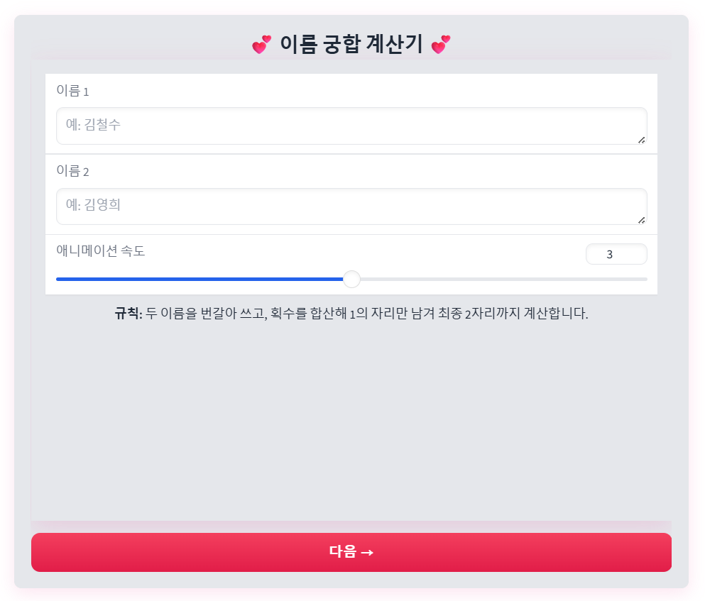
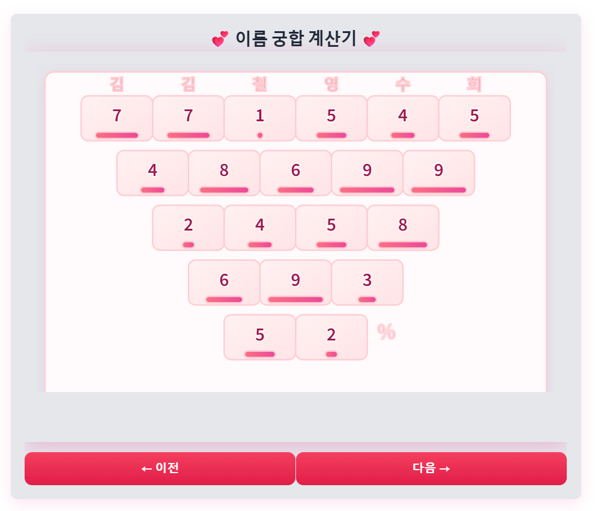

# name-destiny
**Korean name compatibility visualizer — interleaved names → stroke-based reduction → final 2-digit score with explanation. (For fun)**


> 한글 이름을 교차 배열 → 자모 획수 기반 축약으로 2자리 점수를 만들고, SVG 애니메이션으로 계산 과정을 시각화합니다. 결과(두 자리)와 마지막 자리 기반 해설을 제공합니다.

---

## Demo
- 실행 화면 / 계산 애니메이션
  
  

---

## Features
- **3단계 위저드 UI**: 입력 → 계산(애니메이션) → 결과(점수·해설 카드)
- **SVG 애니메이션**: 줄단위 드로잉/드롭, 마지막에 `%` 페이드인 및 반짝 효과(옵션)
- **한글 전용 로직**: 자모 분해·획수 테이블 기반 계산 (재미용 기준)
- **그레이디오(Gradio) UI**: 브라우저에서 바로 사용

---

## Quick Start
```bash
# 1) 설치
python -m venv .venv && source .venv/bin/activate   # Windows: .venv\Scripts\activate
pip install -r requirements.txt

# 2) 실행
python app.py
```
- 기본 접속: http://127.0.0.1:7860
- 외부에서 접속 필요 시 app.py 기본 설정상 0.0.0.0:7860로 열립니다.

---

## How it works

1. **Interleave** : 두 이름의 한글 음절을 번갈아 섞음
2. **Stroke mapping** : 각 음절 → (초성/중성/종성 분해) → 획수 합 → 1의 자리
3. **Reduction** : 인접 합의 1의 자리로 줄여가며 길이가 2가 될 때까지 반복
4. **Result** : 최종 두 자리 중 마지막 자리로 간단 해석 매핑

> ⚠️ 획수 기준은 통일된 표준이 없어, 프로젝트는 일관된 내부 테이블을 사용합니다. 엔터테인먼트(재미) 목적입니다.

---

## Project Structure

name-destiny/
├─ app.py           # 메인: Gradio UI(3단계), SVG 주입/전환 로직
├─ name_core.py     # 한글 자모 분해, 획수 테이블, 축약 알고리즘
├─ name_svg.py      # SVG 애니메이션 생성(build_viz)
├─ layout.py        # 레이아웃/좌표 계산
├─ requirements.txt
└─ README.md


---

## Known Notes

- 한글 외 문자는 계산에서 제외됩니다(한글 음절 필터 적용).

- 폰트 환경에 따라 미세한 렌더링 차이가 날 수 있습니다.
